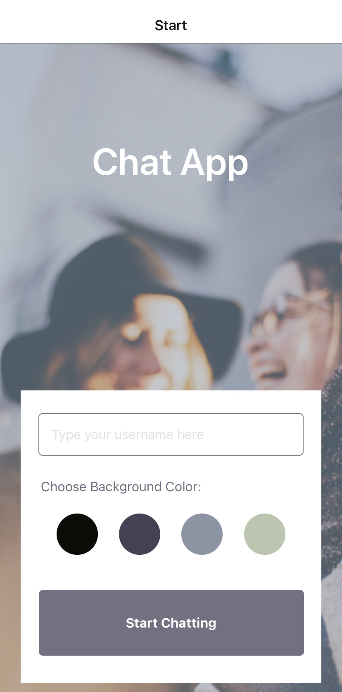

# Chat App

## Overview

### Image

### Video

<video width="320" height="240" controls>
  <source src="assets/videochatapp.MP4" type="video/mp4">
  Your browser does not support the video tag.
</video>

### Objective
The goal of this project is to create a mobile Chat App using React Native, providing users with a dynamic chat interface. The application will support image and location sharing features.

### Technologies
- React Native
- Expo
- Google Firestore (Database, authentication, Storage)
- Gifted Chat library

## Features

### Main Page
- Users can enter their name and choose from 4 background colors for the chat page before joining.

### Chat Page
- Real-time messaging: Users can send and receive messages, images, and location information.

### Data Storage
- Online and offline data storage capabilities.

## Getting Started

### Prerequisites
- Node.js installed (make sure to downgrade to version “16.19.0”)
- Expo CLI installed (`npm install -g expo-cli`)

### Installation Steps
1. Clone this GitHub project into a new folder or download the zip file.
2. Open your terminal and navigate to the project folder.
3. Run the following commands:
    npm install
    expo start
4. Download the "Expo Go" app on your mobile device.
5. Scan the QR code displayed in the terminal using the Expo Go app to join the chat application.

Feel free to explore and test the features of the Chat App on your mobile device!

## Note
Make sure to have Node.js and Expo CLI installed before running the application. If you encounter any issues, refer to the documentation of the respective technologies used in this project.

Enjoy chatting!
